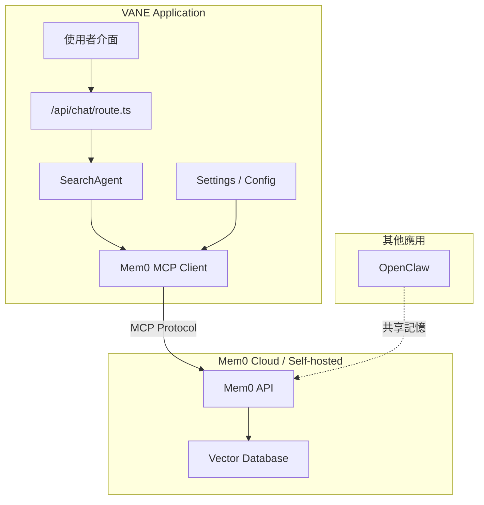
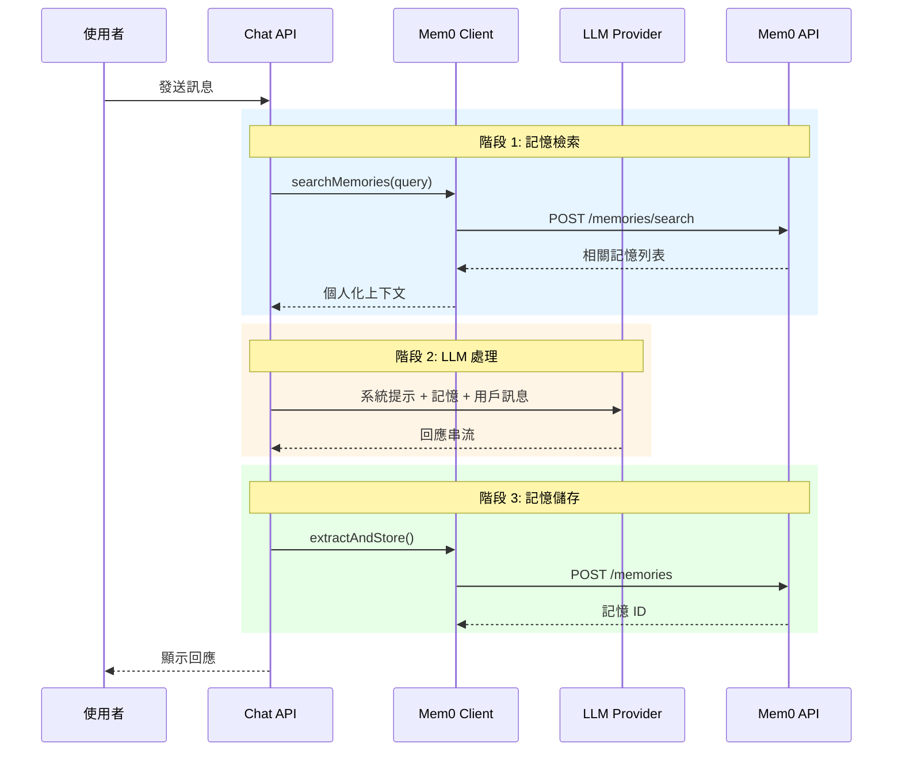

# Mem0 MCP 整合架構設計

## 概述

本文件描述如何在 VANE 專案中整合 Mem0 作為 MCP 伺服器，實現個人化長期記憶層（Memory Layer）。這個架構讓 AI 能夠記住用戶的偏好、歷史對話和個人資訊，並在 VANE 與其他應用（如 OpenClaw）之間共享這些記憶。

## 系統架構



## 核心組件

### 1. Mem0 MCP Client

位置：`src/lib/mcp/mem0/client.ts`

負責與 Mem0 MCP 伺服器通訊，提供以下功能：

| 方法 | 描述 | 使用場景 |
|------|------|----------|
| `searchMemories` | 根據查詢語句檢索相關記憶 | 每次用戶發送訊息前 |
| `addMemory` | 添加新記憶 | 對話結束後自動提取 |
| `updateMemory` | 更新現有記憶 | 用戶修正或更新資訊 |
| `deleteMemory` | 刪除記憶 | 用戶刪除敏感資訊 |
| `getAllMemories` | 獲取所有記憶 | 記憶管理 UI |

### 2. 記憶整合流程



### 3. 記憶注入策略

#### 系統提示模板

```typescript
const SYSTEM_PROMPT_WITH_MEMORY = `
你是一個有記憶的 AI 助手。以下是關於用戶的相關記憶：

<memories>
{{relevant_memories}}
</memories>

請在回答時考慮這些記憶，但不需要直接引用它們。
如果記憶與當前問題無關，請忽略它們。

{{original_system_instructions}}
`;
```

#### 記憶相關性評分

- 使用 Mem0 的內建相似度搜索
- 設定閾值（例如：相似度 > 0.7 才納入）
- 限制注入記憶數量（例如：最多 5 條，避免 token 過多）

### 4. 自動記憶提取

在每次對話結束後，自動提取值得記憶的資訊：

```typescript
const extractionPrompt = `
分析以下對話，提取需要長期記憶的資訊：
- 用戶的個人偏好
- 重要的個人資訊
- 重複出現的主題或需求
- 任何有助於未來對話的上下文

對話：
{{conversation}}

請以 JSON 格式返回：
{
  "memories": [
    {"content": "記憶內容", "importance": "high|medium|low"}
  ]
}
`;
```

## 配置管理

### 環境變數

```bash
# Mem0 配置
MEM0_API_KEY=your_mem0_api_key
MEM0_API_URL=https://api.mem0.ai  # 或自托管 URL
MEM0_DEFAULT_USER_ID=default_user

# 可選：功能開關
MEM0_ENABLED=true
MEM0_AUTO_EXTRACT=true
MEM0_MAX_MEMORIES_PER_QUERY=5
```

### 設定介面

在 Settings 頁面新增 Mem0 區塊：

```typescript
interface Mem0Settings {
  enabled: boolean;
  apiKey: string;
  userId: string;
  autoExtract: boolean;
  maxMemories: number;
  similarityThreshold: number;
}
```

## 多應用記憶共享

### 統一用戶識別

使用一致的 `user_id` 跨越 VANE 和 OpenClaw：

```typescript
// 推薦：使用雜湊的用戶識別碼
const userId = hash(user.email + globalSalt);
```

### 命名空間設計

```typescript
interface MemoryMetadata {
  app: 'vane' | 'openclaw';      // 來源應用
  type: 'preference' | 'fact' | 'context';
  timestamp: string;
  sessionId?: string;
}
```

### 跨應用記憶存取

Mem0 允許相同 `user_id` 的所有應用存取共享記憶，實現無縫體驗。

## 安全與隱私

### 資料保護

1. **敏感資訊過濾**：在儲存前自動檢測並過濾密碼、API keys 等
2. **用戶控制**：允許用戶查看、編輯、刪除自己的記憶
3. **選擇性記憶**：用戶可以標記某些對話為"不記憶"

### 實作範例

```typescript
// 敏感資訊檢測
const SENSITIVE_PATTERNS = [
  /password[:\s]+\S+/gi,
  /api[_-]?key[:\s]+\S+/gi,
  /token[:\s]+\S+/gi,
  /\b\d{4}[\s-]?\d{4}[\s-]?\d{4}[\s-]?\d{4}\b/g,  // 信用卡
];

function sanitizeMemory(content: string): string {
  let sanitized = content;
  SENSITIVE_PATTERNS.forEach(pattern => {
    sanitized = sanitized.replace(pattern, '[REDACTED]');
  });
  return sanitized;
}
```

## 效能優化

### 快取策略

```typescript
// 記憶快取（記憶不會頻繁變更）
const memoryCache = new Map<string, {
  memories: Memory[];
  timestamp: number;
}>();

const CACHE_TTL = 5 * 60 * 1000; // 5 分鐘
```

### Token 優化

- 限制注入記憶數量（預設 5 條）
- 截斷過長的記憶內容
- 使用記憶摘要而非完整內容

## 錯誤處理

### 降級策略

如果 Mem0 服務不可用：

1. 記錄錯誤日誌
2. 繼續正常對話（無個人化記憶）
3. 顯示可選的通知給用戶

```typescript
try {
  const memories = await mem0Client.searchMemories(query);
  // 注入記憶到系統提示
} catch (error) {
  console.error('Mem0 search failed:', error);
  // 繼續無記憶模式
}
```

## 檔案結構

```
src/
└── lib/
    └── mcp/
        ├── mem0/
        │   ├── client.ts       # MCP 客戶端實作
        │   ├── types.ts        # TypeScript 類型定義
        │   ├── config.ts       # 配置管理
        │   ├── cache.ts        # 快取邏輯
        │   └── utils.ts        # 工具函數
        └── tools/
            └── registry.ts     # 工具註冊表
```

## 實作優先順序

### Phase 1: MVP (核心功能)
1. 基礎 MCP 客戶端
2. 記憶檢索與注入
3. 基本配置 UI

### Phase 2: 增強功能
1. 自動記憶提取
2. 記憶管理介面
3. 快取優化

### Phase 3: 進階功能
1. 跨應用同步
2. 記憶分析與統計
3. 進階隱私控制

## 參考資源

- [Mem0 Documentation](https://docs.mem0.ai/)
- [Model Context Protocol Spec](https://spec.modelcontextprotocol.io/)
- [MCP TypeScript SDK](https://github.com/modelcontextprotocol/typescript-sdk)
